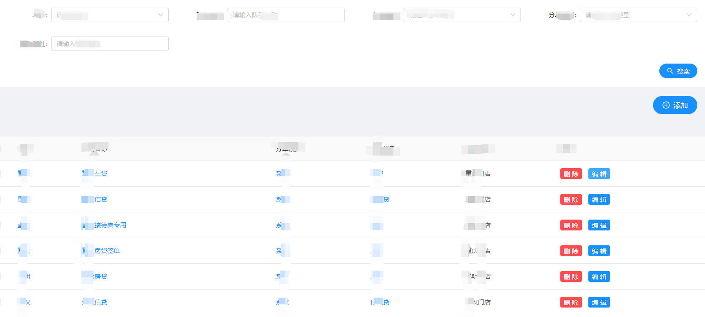
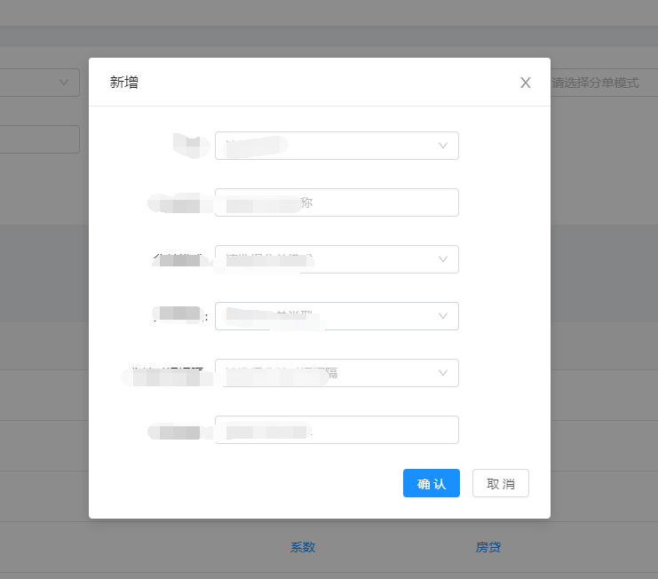
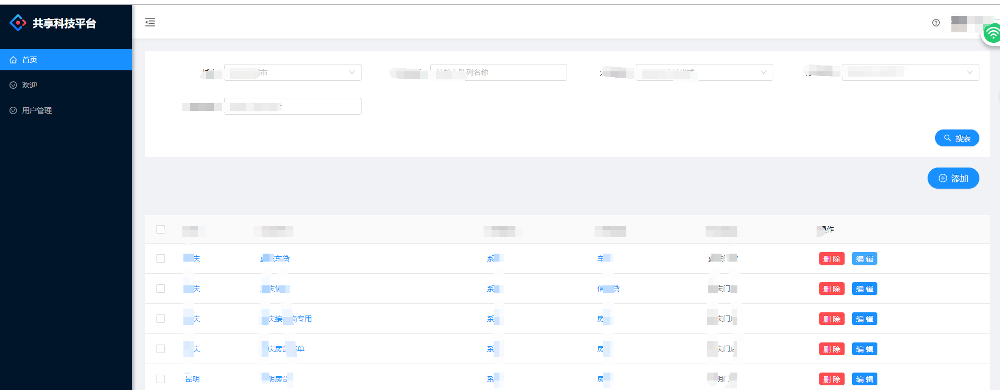

# Ant Design Pro

This project is initialized with [Ant Design Pro](https://pro.ant.design). Follow is the quick guide for how to use.

## Environment Prepare

Install `node_modules`:

```bash
npm install
```

or

```bash
yarn
```

## Provided Scripts

Ant Design Pro provides some useful script to help you quick start and build with web project, code style check and test.

Scripts provided in `package.json`. It's safe to modify or add additional script:

### Start project

```bash
npm start
```

### Build project

```bash
npm run build
```

### Check code style

```bash
npm run lint
```

You can also use script to auto fix some lint error:

```bash
npm run lint:fix
```

### Test code

```bash
npm test
```
## 完成与后端服务交互，响应拦截，实现登录跳转，获取用户信息，一个完整得增删改查案列，后期实现动态路由权限控制



## More

You can view full document on our [official website](https://pro.ant.design). And welcome any feedback in our [github](https://github.com/ant-design/ant-design-pro).
